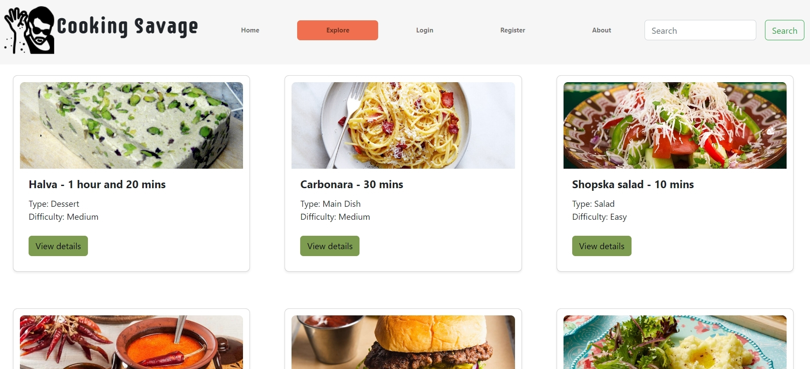

# CookingSavage
## Table of contents

- [Overview](#overview)
  - [The project](#the-project)
  - [Screenshot](#screenshot)
  - [Links](#links)
  - [Built with](#built-with)
  - [Start project](#start-project)
  - [Used assets](#used-assets)
- [Author](#author)

## Overview

### The project

CookingSavage is a web application that allows users to share and discover new recipes with others.

<b>User Authentication</b><br/>
The application requires users to register and log in before they can access certain features, such as creating, sharing, commenting recipes. Users can create an account by providing their username, email address and a password. Once they have registered, they can log in using their email address and password.

<b>Recipe Management</b><br/>
Users can create and manage their own recipes. They can add a new recipe by providing a recipe name, dish type, number of servings, cooking time, difficulty description, ingredients, instructions and a photo of the finished dish. Once a recipe has been created, it can be edited or deleted at any time.

<b>Recipe Search</b><br/>
Users can search for recipes by recipe name keyword. 


### Screenshot





### Links

- Live Site URL: [Link](https://cookingsavage.vercel.app/)

### Built with

- ReactJS
- React Hook Form
- React-Bootstrap
- Custom CSS
- Softuni practice server for backend: [Link](https://github.com/softuni-practice-server/softuni-practice-server)

### Start project

Clone the repository - https://github.com/NedDinev/cooking-social-network.git

<b>Install client node_modules. Open the project main folder with your code editor and type the following code in terminal:</b><br/>
```js
cd client
npm install
```
<b>Install server node_modules. Open the project main folder with your code editor and do the same for the server:</b><br/>
```js
cd client
npm install
```
<b>To run the client simply type "npm start" in terminal while being in the client folder.</b><br/>
<b>To run the server type "node server" in terminal while being in the server folder.</b><br/>

### Used assets

- Logo and icons - [Link](https://icons8.com/)
- Illustrations - [Link](https://www.freepik.com/)

## Author
- Github - [NedDinev](https://www.github.com/neddinev)


